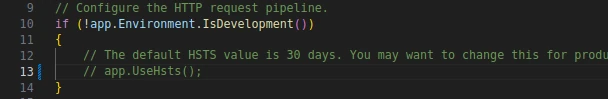

## Overview

I've been trying to learn React because I need to for work, but also it's been sort of fun. we use Typescript in work so It's been the focus of my investigations. We also use dotnet for our APIs it's always been a bit of a bugbear of mine that we have two separate projects one for the React front-end and one for the dotnet API, why can't we have both in one Project?

It turns out that we can so long as you want to use React.js and that's just sad 😦 I know from [this post](https://devblogs.microsoft.com/visualstudio/new-react-typescript-spa-templates-and-more/) that M$ are planning to update their React and ASP.NET Core Template, but until then I'll have to make my own.

I'm working in Linux with Visual Studio Code, my prefered method of creating React projects is Vite, I also use Tailwind for my CSS and Lucide React for the Icons.

## Create a web project

start with a new folder to hold everything

```bash
mkdir todo
cd todo
```

Then we start creating our project as normal

```bash
# Start your git repo
git init
# Make a publish folder for later
mkdir ./publish
# Create a solution file
dotnet new sln --name todo
# Next the react project template
dotnet new react -o todo
# Because we are using git as source control we'll need a git ignore file this will be set up with all the things we need
dotnet new gitignore
# Now we need to connect the project to the solution
dotnet sln add ./todo/todo.csproj
# The next command uses NuGet to restore dependencies as well as project-specific tools that are specified in the project file.
dotnet restore
# the next two lines will build and run the new project just to be sure.
dotnet build todo.sln
dotnet run --project ./todo/todo.csproj
```

Once the build and run have finished you can use Ctrl-Click to open the url in a browser but you'll be greeted with a Warning about a self-signed cert:-


Click "Advanced" then "Accept the Risk and Continue" or whatever the equivalent is for your chosen browser then you get the SPA Proxy screen and then it will redirect to the site proper when it's server is up and running.


but first another browser knows best page to protect you from yourself:-


Click "Advanced" then "Accept the Risk and Continue" AGAIN! And finaly you can see the web page that you made and hosted on your own computer... 🙄


## Replace the React Project

Once you've had your fill of clicking the counter and marveling at the weather report. close the browser and we'll begin.

from your PWD open VS code

```bash
code ./
```


In the File Explorer delete the ClientApp Folder


Open a Terminal window in code


The terminal will open at the level of the solution so change to the project dir (todo)

Create the new React project in a folder called ClientApp (I'm using Vite)

``` bash
cd todo
npm create vite@latest ClientApp -- --template react-ts
```


## configure all the things

open the ClientApp/package.json file and find the "scripts" section change the key value from "dev" to "start" and change the value to "vite --port 8080"


open the project file (todo.csproj) find the node called SpaProxyServerUrl and change the value to "http://localhost:8080" (change https to http and the port number to 8080)


Open Program.cs and find the line "app.UseHsts();" and comment it out



Open "Properties/launchSettings.json" and remove the Https url from "profiles: %ProjectName%: applicationUrl" to only leave the http one. (eg)


## Run the New project

open the Run and Debug panel (Ctrl+Shift+D in Linux)


click the "create a launch.json file" link

Select the C# option


Click Add Configuration...


Type the name of the project (todo) hit tab to move to next config item 


and type the folder of the project (todo/)


tab one last time to finish.

Press F5 to compile and run in debug

You now have a React Typescript site that will call your packaged api


At this point might I suggest you add everything and commit to git just to save your place.


## fetch that Weather

Lets add a weather table to our demo page.

Add a new folder to the src folder in your ClientApp called *components* then create a new File in that folder called *FetchData.tsx*

paste the following into it:-

``` typescript
import { useEffect, useState } from "react";

type ForecastsType = {
    date: string
    temperatureC: number
    temperatureF: number
    summary?: string
}

export default function FetchData() {
    const [ loading, setLoading ] = useState(true)
    const [ forecasts, setForecasts ] = useState<ForecastsType[]>([])

    useEffect(() => {
        try {
            setLoading(true)
            fetch("http://localhost:5117/weatherforecast")
                .then((response) => response.json())
                .then((data) => {
                    setForecasts(data)
                    setLoading(false)
            });
        } catch (err) {
          console.log(err);
        }
    }, [])

    return (
        <>
            {loading && (<p><em>Loading...</em></p>)}
            {!loading && (
            <table>
            <thead>
                <tr>
                <th>Date</th>
                <th>Temp. (C)</th>
                <th>Temp. (F)</th>
                <th>Summary</th>
                </tr>
            </thead>
            <tbody>
                {forecasts.map((forecast) => (
                <tr key={forecast.date}>
                    <td>{new Date(forecast.date).toLocaleString()}</td>
                    <td>{forecast.temperatureC}</td>
                    <td>{forecast.temperatureF}</td>
                    <td>{forecast.summary}</td>
                </tr>
                ))}
            </tbody>
            </table>
            )}
        </>
      );
}
```

On the line with the fetch command (*fetch("http://localhost:5117/weatherforecast")*) make sure the port number matches the one in "Properties/launchSettings.json"

Next open App.tsx and replace the content with :-

``` typescript
import { useState } from 'react'
import reactLogo from './assets/react.svg'
import viteLogo from '/vite.svg'
import './App.css'
import FetchData from './components/FetchData'

function App() {
  const [count, setCount] = useState(0)

  return (
    <>
      <div>
        <a href="https://vitejs.dev" target="_blank">
          
        </a>
        <a href="https://react.dev" target="_blank">
          
        </a>
      </div>
      <h1>Vite + React</h1>
      <div className="card">
        <button onClick={() => setCount((count) => count + 1)}>
          count is {count}
        </button>
        <p>
          Edit <code>src/App.tsx</code> and save to test HMR
        </p>
      </div>
      <p className="read-the-docs">
        Click on the Vite and React logos to learn more
      </p>
      <div className="card">
        <FetchData />
      </div>
    </>
  )
}

export default App
```

## Test new API call

Pressing F5 should give you something like the following:-


## Publishing to LIVE

Now this is where I have to explain what you've got here.

### In Development

Pressing F5 calls the dotnet build command which will compile the c# project and as a post build proccess call **npm run start** which will build the React part and start a server listening on port 8080. Kestral then runs a server listening to that port from the "Properties/launchSettings.json" file.

So in development you are running two servers until you stop debugging and both are cleanly shutdown.

### In Production

In production you will call the dotnet publish command which will again compile all the required files but now you need to copy the content of

> "${workspaceFolder}/${projectFolder}/ClientApp/public/"

to

> "${publishOutputFolder}/wwwRoot/"

in the *Program.cs* file you'd have seen the line

``` cSharp
    app.MapFallbackToFile("index.html");
```

This line tells Kestrel to serve the index.html page of the React app if you request the root file ie no controller. By putting the support files in the **wwwRoot** folder, Kestrel serves up anything it finds like a real webserver.

## Conclusion

I stripped out the TLS support in the project because it adds an unnecessary level of complexity in development that when you deploy to LIVE, it will be covered by your production server (Apache/NginX) before it proxies to Kestrel to handle the request.

This was a quick and dirty method to get the project working, I'm sure someone will tell me what I've done wrong, but it works and that's all I need right now.
